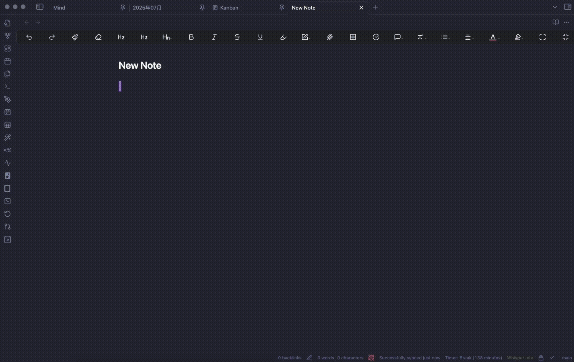

# Obsidian Remote Attachments

This is a plugin for [Obsidian](https://obsidian.md) that allows you to upload attachments from your vault to a remote S3-compatible object storage and replace the local links with their public URLs.

This is useful for keeping your vault size small and making your notes more portable and shareable across the web.

## Demo

## Features

- Upload attachments to any S3-compatible storage service (e.g., AWS S3, Cloudflare R2, MinIO).
- Automatically replaces local file links (`![[image.png]]`) with remote markdown links (`!`).
- Support for customizing the remote path.

## How to Install

1.  Open Obsidian's settings.
2.  Go to `Community plugins` and make sure `Restricted mode` is **off**.
3.  Click `Browse` to open the community plugins browser.
4.  Search for "Remote Attachments".
5.  Click `Install`.
6.  Once installed, click `Enable` to activate the plugin.

## Configuration

After enabling the plugin, you must configure your S3-compatible storage provider in the plugin's settings page.

!Screenshot of the settings page

Here are the details for each setting:
- **Endpoint**: The endpoint URL of your S3-compatible service.
- **Access Key ID**: Your access key for the service.
- **Secret Access Key**: Your secret access key.
- **Bucket Name**: The name of the bucket where you want to store your attachments.
- **Region**: The region of your bucket (e.g., `us-east-1`).
- **Base URL (Optional)**: The public base URL for accessing your files. If your bucket is public, this might be something like `https://s3.your-region.amazonaws.com/your-bucket` or a custom domain. The final URL will be `{Base URL}/{filename}`. If left empty, the plugin will try to construct a standard S3 URL.

**Example for Cloudflare R2:**
- **Endpoint**: `https://<ACCOUNT_ID>.r2.cloudflarestorage.com`
- **Access Key ID**: Your R2 Access Key ID.
- **Secret Access Key**: Your R2 Secret Access Key.
- **Bucket Name**: Your R2 bucket name.
- **Region**: `auto`
- **Base URL**: Your R2 public bucket URL (e.g., `https://pub-....r2.dev`).

> **Warning**: Your credentials are stored locally on your device. Be mindful of security best practices.

## How to Use

Simply drag and drop one or more image files from your computer directly into a note in Obsidian.

The plugin will automatically:
1.  Upload each image to your configured S3-compatible storage.
2.  Replace the local file link with the public URL in your note.

## Contributing

Pull requests are welcome. For major changes, please open an issue first to discuss what you would like to change.

## License

This project is licensed under the MIT License. See the LICENSE.md file for details.

Copyright (c) 2025 moritamori
